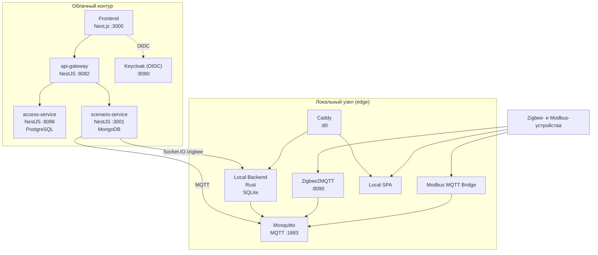

# Domovoy — Smart Home System

Гибридная платформа автоматизации здания. Облачный контур обеспечивает управление, каталог устройств и разграничение доступа; локальный узел работает автономно на объекте и синхронизирует данные с облаком при наличии связи.

## Содержание

- [Архитектура](#архитектура)
- [Структура репозитория](#структура-репозитория)
- [Стек технологий](#стек-технологий)
- [Быстрый старт — облако](#быстрый-старт--облако)
- [Быстрый старт — локальный сервер](#быстрый-старт--локальный-сервер)
- [Разработка](#разработка)
- [Переменные окружения](#переменные-окружения)
- [Сервисы и порты](#сервисы-и-порты)
- [API документация](#api-документация)

---

## Архитектура



**Ключевые свойства:**
- Облачный контур работает без локального узла
- Локальный узел работает без интернета (автономный режим)
- При наличии связи данные синхронизируются двусторонне
- Аутентификация через Keycloak (OIDC/OAuth 2.0) в обоих контурах

---

## Структура репозитория

```
/
├── backend/                         # NestJS микросервисы (pnpm workspace)
│   └── apps/
│       ├── access-service/          # RBAC/ABAC, дома, члены, роли (PostgreSQL)
│       ├── scenario-service/        # Физ. устройства, Zigbee MQTT, сценарии (MongoDB)
│       └── api-gateway/             # JWT-верификация, маршрутизация запросов
├── frontend/                        # Next.js 16 (App Router)
├── infrastructure/                  # Docker Compose для облачной инфраструктуры
│   ├── docker-compose.yml           # PostgreSQL, MongoDB, Redis, Keycloak, EMQX
│   ├── postgres/                    # init-databases.sh
│   ├── keycloak/                    # Dockerfile, realm-export.json, тема domovoy
│   ├── emqx/                        # emqx.conf
│   └── nginx/                       # nginx.conf (опционально)
├── local-server/                    # Локальный edge-узел
│   ├── docker-compose.yml           # Весь локальный стек
│   ├── local-backend/               # Rust-сервер (SQLite, MQTT, синхронизация)
│   ├── local-frontend/              # SPA для оператора в локальной сети
│   ├── modbus-mqtt-bridge/          # Modbus RTU → MQTT
│   ├── mosquitto/                   # MQTT-брокер
│   ├── zigbee2mqtt/                 # Zigbee-координатор → MQTT
│   └── caddy/                       # Reverse proxy + SPA
├── docker-compose.yml               # Полный облачный стек (все сервисы + инфра)
└── .env.cloud.example               # Шаблон переменных окружения
```

---

## Стек технологий

| Слой | Технологии |
|---|---|
| **Frontend** | Next.js 16, React 19, TypeScript, Zustand, shadcn/ui, Tailwind CSS v4, Konva.js |
| **Backend** | NestJS 11, TypeScript, Prisma (PostgreSQL), Mongoose (MongoDB) |
| **Local backend** | Rust, SQLite, Axum, tokio-mqtt |
| **Auth** | Keycloak (OIDC), NextAuth.js beta, JWT |
| **Realtime** | Socket.IO (namespace `/zigbee`), MQTT (EMQX / Mosquitto) |
| **Инфра** | PostgreSQL, MongoDB, Redis, EMQX, Docker Compose |

---

## Быстрый старт — облако

Для облачного деплоя все сервисы поднимаются одной командой.

### Требования

- Docker и Docker Compose v2
- 4 GB RAM (Keycloak + базы данных)

### 1. Переменные окружения

```bash
cp .env.cloud.example .env
```

Обязательно задайте в `.env`:

```env
AUTH_SECRET=          # npx auth secret
AUTH_KEYCLOAK_ID=     # client id из Keycloak
AUTH_KEYCLOAK_SECRET= # client secret из Keycloak
```

Остальные параметры имеют рабочие значения по умолчанию для `localhost`.

### 2. Сборка и запуск

```bash
docker compose build
docker compose up -d
```

### 3. Первоначальная настройка Keycloak

1. Откройте `http://localhost:8080` → войдите (`admin` / `admin`)
2. Перейдите в **Clients → smart-home-frontend → Credentials**
3. Скопируйте `Client Secret` в `.env` как `AUTH_KEYCLOAK_SECRET`
4. Пересоберите frontend: `docker compose up -d --build frontend`

### 4. Проверка

| URL | Что откроется |
|---|---|
| `http://localhost:3000` | Веб-приложение |
| `http://localhost:8080` | Keycloak Admin Console |
| `http://localhost:8082/api/v1/docs` | Swagger API Gateway |
| `http://localhost:8086/api/docs` | Swagger access-service |
| `http://localhost:3001/docs` | Swagger scenario-service |
| `http://localhost:18083` | EMQX Dashboard |

### Деплой на сервер

Для продакшена замените `localhost` на публичный домен или IP во всех `NEXT_PUBLIC_*`, `AUTH_*` и `KEYCLOAK_ISSUER` переменных перед сборкой:

```bash
# Пример для домена myapp.example.com
NEXT_PUBLIC_API_URL=https://myapp.example.com:8082 \
NEXT_PUBLIC_ACCESS_API_URL=https://myapp.example.com:8086 \
AUTH_URL=https://myapp.example.com:3000 \
AUTH_KEYCLOAK_ISSUER=https://myapp.example.com:8080/realms/smart-home \
docker compose build frontend
```

> **Важно:** `NEXT_PUBLIC_*` переменные вшиваются в JS-бандл **при сборке**. При смене домена нужен `docker compose build frontend`.

---

## Быстрый старт — локальный сервер

Локальный узел разворачивается отдельно на Linux-хосте с подключёнными Zigbee и Modbus адаптерами.

```bash
cd local-server
cp .env.example .env
# Задайте ZIGBEE_DEVICE, MODBUS_DEVICE и URL облачных сервисов
docker compose up -d --build
```

Подробнее: [`local-server/README.md`](local-server/README.md)

---

## Разработка

### Инфраструктура (только БД, Keycloak, MQTT)

```bash
cd infrastructure
docker compose up -d
```

### Backend сервисы

```bash
cd backend

# Установка зависимостей + генерация Prisma-клиентов
pnpm install

# Запуск отдельных сервисов
pnpm run access:dev      # access-service  → localhost:8085
pnpm run devices:dev     # device-service  → localhost:3000  (если есть)
pnpm run scenario:dev    # scenario-service → localhost:3001
pnpm run gateway:dev     # api-gateway     → localhost:8080
```

Из директории конкретного сервиса:

```bash
cd backend/apps/access-service
pnpm run prisma:migrate  # применить миграции
pnpm run prisma:studio   # Prisma Studio GUI
pnpm run seed            # заполнить тестовыми данными
```

### Frontend

```bash
cd frontend
pnpm install
pnpm dev    # localhost:3000
```

---

## Переменные окружения

### Облако (`.env` в корне)

Полный список с описаниями: [`.env.cloud.example`](.env.cloud.example)

| Переменная | Описание |
|---|---|
| `AUTH_SECRET` | Секрет сессий NextAuth (`npx auth secret`) |
| `AUTH_KEYCLOAK_ID` | Client ID в Keycloak |
| `AUTH_KEYCLOAK_SECRET` | Client Secret из Keycloak |
| `AUTH_KEYCLOAK_ISSUER` | URL realm (`http://localhost:8080/realms/smart-home`) |
| `NEXT_PUBLIC_API_URL` | URL api-gateway (доступен из браузера) |
| `POSTGRES_PASSWORD` | Пароль суперпользователя PostgreSQL |
| `MONGO_PASSWORD` | Пароль MongoDB |
| `KEYCLOAK_ADMIN_PASSWORD` | Пароль администратора Keycloak |

### Backend (`.env` в `backend/`)

Шаблон: [`backend/.env.example`](backend/.env.example)

| Переменная | Описание |
|---|---|
| `ACCESS_CONTROL_DB_URL` | PostgreSQL для access-service |
| `SCENARIO_DATABASE_URL` | MongoDB для scenario-service |
| `CENTRAL_MQTT_URL` | MQTT-брокер (`mqtt://localhost:1883`) |

### Frontend (`.env.local` в `frontend/`)

Шаблон: [`frontend/.env.example`](frontend/.env.example)

---

## Сервисы и порты

### Облачный контур

| Сервис | Порт | Описание |
|---|---|---|
| frontend | **3000** | Next.js веб-приложение |
| api-gateway | **8082** | Маршрутизация + JWT-верификация |
| access-service | **8086** | RBAC/ABAC, дома, члены, приглашения |
| scenario-service | **3001** | Физ. устройства, Zigbee, сценарии, WebSocket |
| keycloak | **8080** | Identity Provider (Admin: `/`) |
| mqtt-gateway (EMQX) | **1883** | MQTT TCP |
| mqtt-gateway (EMQX) | **8083** | MQTT over WebSocket |
| mqtt-gateway (EMQX) | **18083** | EMQX Dashboard |
| postgres | внутренний | PostgreSQL 18 |
| mongodb | внутренний | MongoDB |
| redis | внутренний | Redis 7 |

### Локальный узел

| Сервис | Порт | Описание |
|---|---|---|
| caddy | **80** | Reverse proxy + Local SPA |
| local-backend | **8080** | Rust API (SQLite) |
| zigbee2mqtt | **8090** | Zigbee2MQTT Web UI |
| mosquitto | **1883** | Локальный MQTT-брокер |

---

## API документация

Swagger UI доступен на каждом сервисе после запуска:

- **api-gateway:** `http://localhost:8082/api/v1/docs`
- **access-service:** `http://localhost:8086/api/docs`
- **scenario-service:** `http://localhost:3001/docs`

---

## Модель доступа (access-service)

Двухуровневая модель:

1. **RBAC** — роль члена дома (`Owner / Admin / Default`) с набором `AccessRight`
2. **ABAC** — политики `AccessPolicy` с атрибутными условиями

Иерархия ресурсов: `House → Room → Device → DeviceFunction`.  
Эффективные права кэшируются; пересчёт: `POST /api/v1/permissions/rebuild`.

## Реалтайм (scenario-service)

```
Zigbee2MQTT → EMQX → scenario-service
  → Socket.IO namespace /zigbee
  → комнаты zigbee:<ieee>
  → frontend useZigbeeTelemetry hook
```

Фронтенд подключается по WebSocket к `/zigbee` и подписывается на телеметрию конкретных устройств через событие `zigbee:subscribe`.
