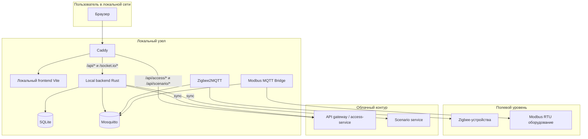
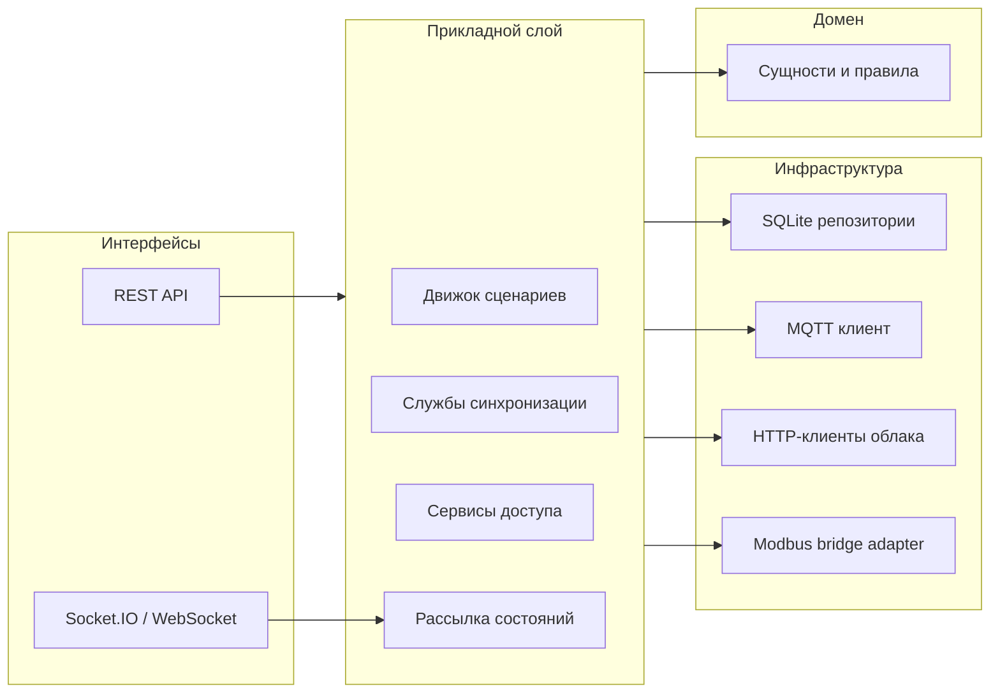
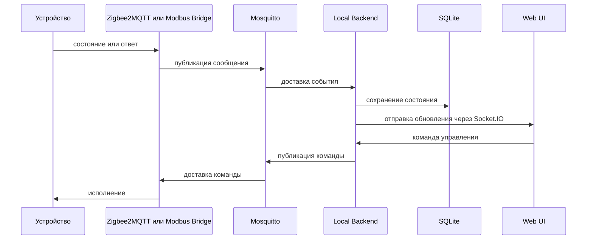
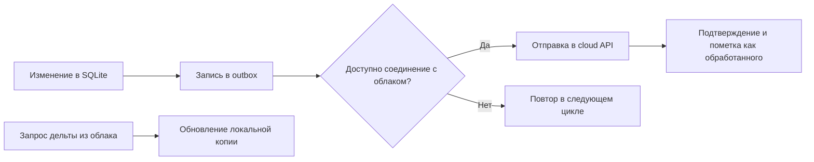

# Local Server

Локальный сегмент гибридной системы управления "умным домом". Репозиторий объединяет веб-интерфейс для локальной сети, сервер на Rust, брокер MQTT, мост `Zigbee2MQTT`, мост `Modbus -> MQTT` и обратный прокси `Caddy`.

Основная цель проекта - обеспечить автономную работу объекта при отсутствии интернета, а при наличии связи синхронизировать локальные данные с облачным контуром.

## Оглавление

- [Развёртывание](#развёртывание)
- [Описание системы](#описание-системы)
- [Архитектура](#архитектура)
- [Потоки данных](#потоки-данных)
- [Порты и точки входа](#порты-и-точки-входа)
- [Переменные окружения](#переменные-окружения)
- [Развертывание на одноплатном компьютере](#развертывание-на-одноплатном-компьютере)

## Развёртывание

Ниже приведён рекомендуемый сценарий запуска всего локального контура через `Docker Compose`.

### 1. Требования

- `Docker` и `Docker Compose`
- Linux-хост или одноплатный компьютер с проброшенными USB-устройствами
- Zigbee-координатор, доступный как `/dev/ttyACM0` или аналогичное устройство
- RS-485 / USB-адаптер для Modbus RTU, доступный как `/dev/ttyUSB0` или аналогичное устройство
- Свободные порты `80`, `8080`, `8090`, `1883`

Примечание: текущий `docker-compose.yml` ориентирован именно на Linux-хост, потому что использует проброс устройств вида `/dev/tty*`. На Windows удобно разрабатывать фронтенд и отдельные сервисы, но промышленное развёртывание предполагает Linux-окружение.

### 2. Подготовка переменных окружения

Скопируйте шаблон:

```bash
cp .env.example .env
```

Минимально проверьте и при необходимости измените:

- `ZIGBEE_DEVICE` - путь к Zigbee-координатору
- `MODBUS_DEVICE` - путь к RS-485 адаптеру
- `BAUD_RATE` - скорость Modbus-шины
- `CADDY_HTTP_PORT` - внешний HTTP-порт локального интерфейса
- `LOCAL_SERVER_SERIAL` - серийный идентификатор локального узла

### 3. Запуск

Из корня `local-server` выполните:

```bash
docker compose up -d --build
```

После старта будут подняты:

- `mosquitto` - MQTT-брокер
- `zigbee2mqtt` - интеграция Zigbee-устройств
- `modbus-bridge` - мост между Modbus RTU и MQTT
- `local-backend` - локальный сервер на Rust
- `caddy` - раздача SPA и обратный прокси API

### 4. Проверка доступности

Откройте в браузере:

- `http://<host>:80` или `http://<host>:<CADDY_HTTP_PORT>` - локальный веб-интерфейс
- `http://<host>:8080/api/system/health` - health-check локального backend
- `http://<host>:8090` - web UI `Zigbee2MQTT`

### 5. Обновление

После изменения исходников или конфигурации:

```bash
docker compose down
docker compose up -d --build
```

Данные MQTT и локальная SQLite-база сохраняются в примонтированных каталогах проекта, поэтому штатный перезапуск не удаляет состояние узла.

## Описание системы

`local-server` - это локальный контур гибридной платформы автоматизации здания. Он обслуживает устройства на объекте, принимает телеметрию, выполняет команды управления, запускает сценарии, сохраняет состояние в `SQLite` и, при наличии связи, синхронизирует данные с облачными сервисами.

Проект рассчитан на следующие задачи:

- автономная работа при отсутствии интернета
- интеграция Zigbee- и Modbus-устройств в единый API
- локальный веб-интерфейс для оператора в сети объекта
- выполнение сценариев автоматизации на периферийном узле
- синхронизация справочников, сценариев и служебных данных с облаком

## Архитектура

### Общая схема развёртывания



Смысл такой схемы:

- `Caddy` отдаёт собранный frontend и проксирует API-запросы
- `local-backend` выступает единым локальным API и центром бизнес-логики
- `Mosquitto` является внутренней шиной обмена событиями
- `Zigbee2MQTT` и `modbus-bridge` приводят разные протоколы к единому MQTT-формату
- `SQLite` хранит локальные данные и служебное состояние синхронизации

### Логическая декомпозиция локального backend

`local-backend` реализован как Rust workspace с разделением на слои:

- `core` - доменные сущности и базовые типы
- `application` - сценарии, синхронизация, оценка доступа, бизнес-сервисы
- `infrastructure` - SQLite, MQTT, HTTP-клиенты облака, Modbus-адаптеры
- `interfaces` - HTTP и WebSocket API
- `gateway` - точка входа приложения и инициализация фоновых задач



### Компоненты локального контура

| Компонент | Назначение |
|---|---|
| `local-frontend` | SPA для оператора в локальной сети: дашборд, устройства, сценарии, комнаты, пользователи, настройки |
| `caddy` | Раздача собранного frontend и reverse proxy для API и WebSocket |
| `local-backend` | Основной локальный сервер на Rust, работающий с `SQLite`, `MQTT`, сценариями и синхронизацией |
| `mosquitto` | Внутренний MQTT-брокер для телеметрии и команд |
| `zigbee2mqtt` | Подключение Zigbee-сети и публикация событий в MQTT |
| `modbus-mqtt-bridge` | Чтение и запись Modbus RTU через MQTT-команды и ответы |

## Потоки данных

### Телеметрия и команды управления



Этот контур нужен для того, чтобы все протоколы устройства выглядели одинаково для интерфейса и прикладной логики.

### Синхронизация с облаком



Локальный сервер поднимает фоновые задачи для:

- отправки накопленных изменений из исходящей очереди
- загрузки дельты по подсистеме доступа
- синхронизации сценариев
- синхронизации физических устройств
- синхронизации виджетных панелей

## Порты и точки входа

| Порт | Компонент | Назначение |
|---|---|---|
| `80` | `caddy` | Основной вход в локальный UI |
| `8080` | `local-backend` | HTTP API локального сервера |
| `8090` | `zigbee2mqtt` | Веб-интерфейс Zigbee2MQTT |
| `1883` | `mosquitto` | MQTT-брокер |

## Переменные окружения

Ниже перечислены наиболее важные параметры из `.env.example`.

| Переменная | Значение по умолчанию | Назначение |
|---|---|---|
| `LOCAL_SERVER_SERIAL` | `00:00:00:00:00:00` | Идентификатор локального узла |
| `SYNC_INTERVAL_SECS` | `300` | Интервал синхронизации с облаком |
| `LOCAL_SERVER_PORT` | `8080` | Порт локального backend на хосте |
| `ZIGBEE_DEVICE` | `/dev/ttyACM0` | Zigbee USB-координатор |
| `MODBUS_DEVICE` | `/dev/ttyUSB0` | RS-485 адаптер |
| `BAUD_RATE` | `9600` | Скорость Modbus RTU |
| `MODBUS_TIMEOUT_MS` | `1000` | Таймаут Modbus-запроса |
| `CADDY_HTTP_PORT` | `80` | Внешний HTTP-порт локального UI |
| `RUST_LOG` | `info` | Уровень логирования Rust-сервисов |

## Развертывание на одноплатном компьютере

Если проект разворачивается на объекте, рекомендуемый порядок такой:

1. Подключить Zigbee-координатор и RS-485 адаптер.
2. Настроить `.env` под конкретный хост.
3. Запустить `docker compose up -d --build`.
4. Проверить доступность UI и `health` endpoint.
5. Подключить устройства и убедиться, что телеметрия приходит через MQTT.
6. При необходимости задать URL облачных сервисов и дождаться первой синхронизации.
